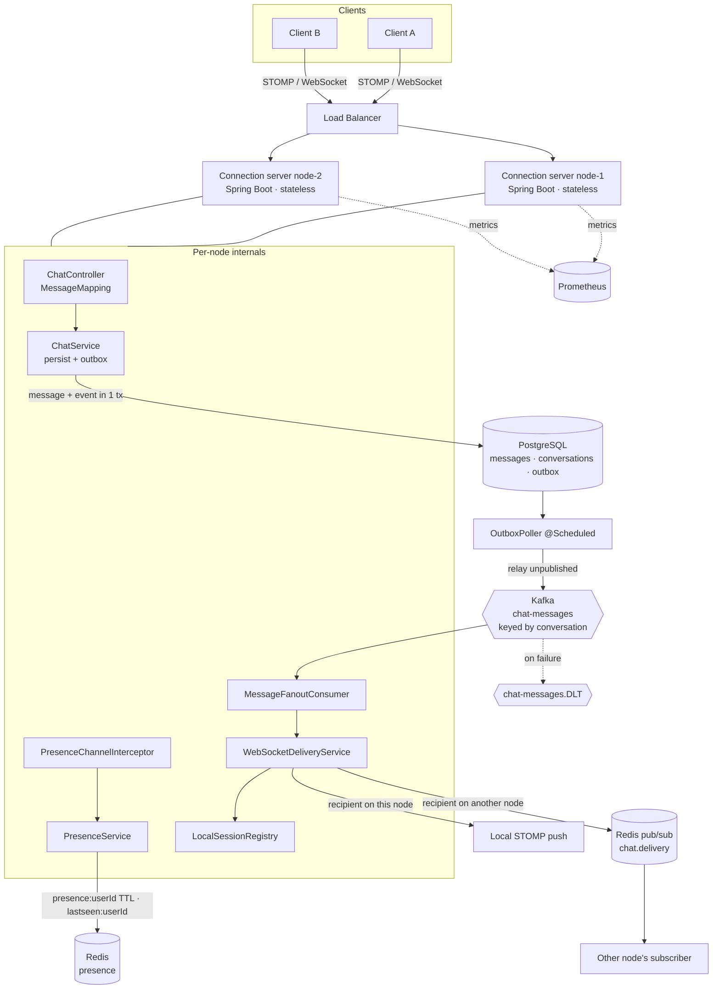
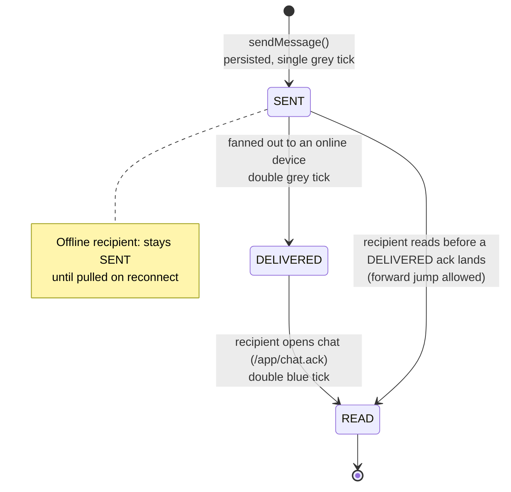
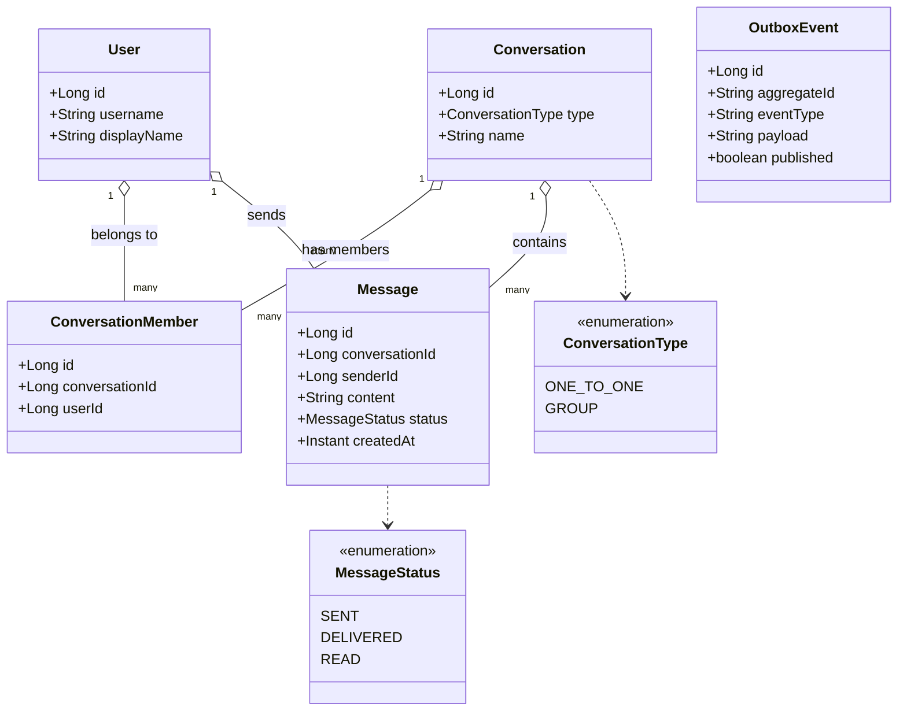
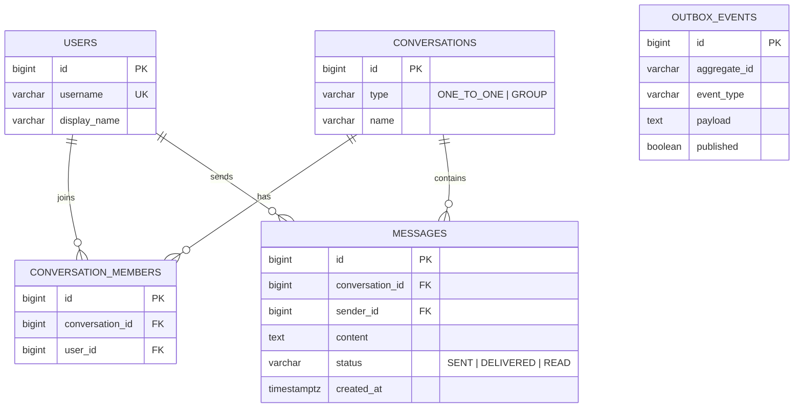

# Chat System — Diagrams

Mermaid diagrams (render natively on GitHub). Generated from the actual entities under
`src/main/java/com/umang/chat/model/entity/` and the service/ws layers.

- [1. High-Level Design (HLD)](#1-high-level-design-hld)
- [2. Message-Send Sequence](#2-message-send-sequence)
- [3. Message Delivery State Machine](#3-message-delivery-state-machine)
- [4. UML Class / ER Diagram](#4-uml-class--er-diagram)

---

## 1. High-Level Design (HLD)



---

## 2. Message-Send Sequence

```mermaid
sequenceDiagram
    participant A as Client A (sender)
    participant WS as Connection server
    participant DB as PostgreSQL
    participant K as Kafka
    participant C as FanoutConsumer
    participant R as Redis (presence + pub/sub)
    participant B as Client B (recipient)

    A->>WS: SEND /app/chat.send {conversationId, content}
    WS->>DB: INSERT message (status=SENT) + INSERT outbox_event  (one tx)
    Note over WS,DB: transactional outbox — no dual-write to Kafka
    WS-->>A: (WS thread returns; ack is async)

    loop OutboxPoller @Scheduled
        WS->>DB: read unpublished outbox rows
        WS->>K: publish MessageEvent (key = conversationId)
        WS->>DB: mark row published
    end

    K->>C: consume MessageEvent
    C->>DB: recipientsOf(conversation) = members - sender
    C->>R: isOnline(B)?
    alt B online on same node
        C->>B: push /user/queue/messages
    else B online on another node
        C->>R: publish CrossNodeEnvelope (chat.delivery)
        R->>B: owning node pushes /user/queue/messages
    else B offline
        Note over C,DB: leave status=SENT; B pulls it on reconnect
    end
    C->>DB: status SENT -> DELIVERED
    C->>A: push /user/queue/receipts (DELIVERED)

    B->>WS: SEND /app/chat.ack {messageId, status=READ}
    WS->>DB: status DELIVERED -> READ
    WS->>A: push /user/queue/receipts (READ)
```

---

## 3. Message Delivery State Machine



---

## 4. UML Class / ER Diagram




