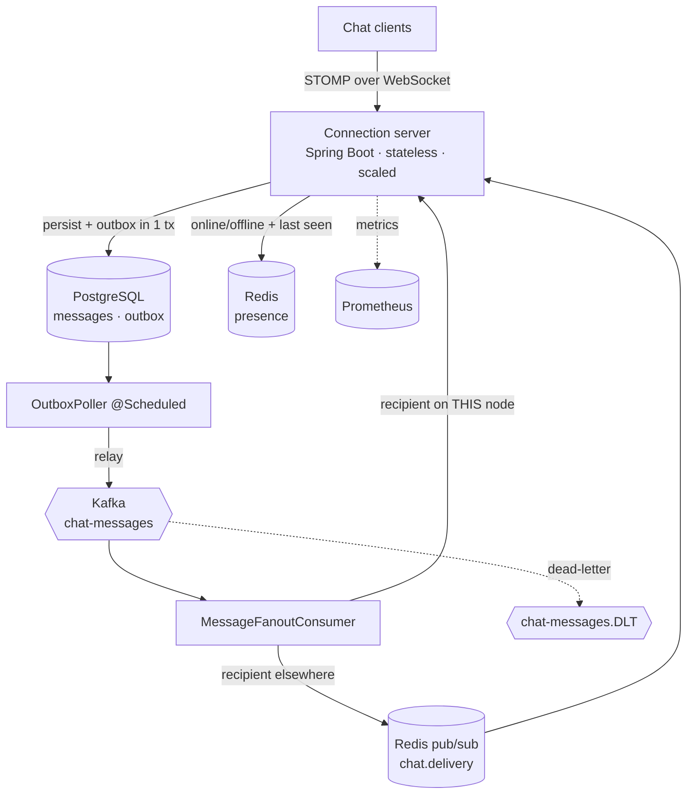

# Chat System (WhatsApp-style)

> A real-time messaging backend (Spring Boot 3.3.5 / Java 21) built as a **system-design
> showcase** — WebSocket/STOMP connection servers, Kafka fan-out via a transactional outbox,
> Redis-backed presence, delivery/read receipts, and offline catch-up with keyset pagination.

This project deliberately implements the *hard* parts of a distributed chat system rather
than a toy in-memory demo: the multi-node fan-out problem, at-least-once event delivery, a
forward-only receipt state machine, and durable message history that survives a client being
offline.

---

📐 **Diagrams:** HLD, message-send sequence, the delivery state machine, and an ER/class
diagram (Mermaid) → [DIAGRAMS.md](DIAGRAMS.md)

## What's inside

| Area | Highlights |
|---|---|
| **Real-time transport** | WebSocket + **STOMP** (`/ws`). Clients send to `/app/chat.send`, subscribe to their private `/user/queue/messages`. Per-user destinations give targeted delivery instead of broadcast. |
| **1:1 and group chat** | One `Conversation` + `ConversationMember` model for both. Fan-out is uniform: "deliver to every member except the sender". |
| **Fan-out** | **Transactional outbox** — the message row and the `MessageEvent` commit in one DB tx; an `@Scheduled` poller relays to **Kafka** (keyed by conversation for ordering). A consumer fans each event out to recipients' sockets. |
| **Multi-node delivery** | Redis **pub/sub** bridges connection servers: if the recipient's socket lives on another node, the consumer publishes to `chat.delivery` and the owning node pushes it. |
| **Presence** | Redis `presence:{userId}` with a **TTL heartbeat** (auto-expires if a client dies) + durable `lastseen:{userId}`. `GET /api/v1/presence/{userId}`. |
| **Receipts** | Forward-only state machine `SENT → DELIVERED → READ`; `/app/chat.ack` advances status and notifies the sender (the WhatsApp tick semantics). |
| **Offline delivery** | Offline recipients leave the message `SENT`; on reconnect they pull `GET /api/v1/conversations/{id}/messages?after={lastId}` — **keyset pagination**. |
| **Resilience** | Kafka DLT + retrying error handler; outbox is at-least-once, so the consumer is idempotent. |
| **Observability** | Actuator health + Micrometer/Prometheus (`/actuator/prometheus`). |
| **Data** | PostgreSQL 17 + Flyway (Hibernate `validate`); Redis 7. |
| **Quality** | Pure **Mockito** unit tests (no Docker); multi-stage non-root Docker; healthcheck-gated compose. |

---

## Architecture



---

## The system-design story

### Why WebSocket (and connection servers)
Chat needs **server push**: the recipient must get a message without polling. A raw HTTP
request/response can't do that, so each client holds a long-lived **WebSocket** to a
*connection server*. We speak **STOMP** over it so we get named destinations — clients
subscribe to their own `/user/queue/messages`, and the server targets a single user with
`convertAndSendToUser` instead of broadcasting to everyone.

Connection servers are **stateless** except for the set of sockets they happen to hold, so
they scale horizontally behind a load balancer. All durable state lives in Postgres (messages)
and Redis (presence), which is what lets any node answer any query.

### The multi-node fan-out problem
Here's the crux. User A's socket is on node 1; user B's socket is on node 2. A sends a
message. The Kafka consumer that picks up the fan-out event runs on *whichever node polls the
partition* — say node 1. Node 1 calls `convertAndSendToUser("B", …)` and… nothing happens,
because B's session lives on node 2's in-memory broker.

Two standard fixes; we use the second:
1. **External STOMP broker relay** (RabbitMQ/ActiveMQ) that every node connects to, so
   destinations are global.
2. **Redis pub/sub bridge** (this project). Each node keeps a `LocalSessionRegistry` of the
   users connected *to it*. When the consumer can't find the recipient locally, it publishes a
   `CrossNodeEnvelope` to the `chat.delivery` channel; every node receives it, checks its own
   registry, and exactly the owning node delivers. A Kafka topic keyed by node id would work
   too. At larger scale you'd replace the broadcast with a `userId → node` routing table so
   delivery is a unicast, not a fan-out.

### Fan-out via the transactional outbox
On send we do **one** DB transaction: insert the message *and* insert a `MessageEvent` row in
`outbox_events`. This avoids the dual-write bug (message saved but Kafka publish fails, or vice
versa). An `@Scheduled` `OutboxPoller` relays unpublished rows to Kafka and marks them
published — **at-least-once**, so the consumer is idempotent. The Kafka key is the
`conversation_id`, so all of a conversation's events land on one partition and are consumed
**in order** — that is how per-conversation message ordering survives the async layer.

### Presence
On WS connect the `PresenceChannelInterceptor` writes `presence:{userId}` to Redis with a
short **TTL**; heartbeats refresh it. If a client crashes without a clean disconnect, the key
simply expires — we never show a dead client as permanently online. A clean disconnect deletes
the key and stamps `lastseen:{userId}` (durable) so "last seen 5m ago" works. Presence lives in
Redis, not app memory, precisely so any stateless node can answer it.

### Delivery + read receipts (the ticks)
`MessageStatus` is a forward-only machine: `SENT` (stored, single grey tick) → `DELIVERED`
(reached a device, double grey tick) → `READ` (opened, double blue tick). The consumer marks
`DELIVERED` when it pushes to an online recipient; the recipient's client later sends
`/app/chat.ack` with `READ` when the conversation is opened. Each transition pushes a
`ReceiptEvent` back to the **original sender** so their ticks update. Backward/duplicate acks
are ignored, which keeps the whole thing idempotent under Kafka's at-least-once redelivery.

### Offline delivery
If a recipient is offline when the event is fanned out, we do nothing extra — the message stays
`SENT` in Postgres. On reconnect the client calls
`GET /api/v1/conversations/{id}/messages?after={lastSeenId}` and pulls everything it missed.
That read uses **keyset (seek) pagination** on the indexed `(conversation_id, id)` — O(log n)
regardless of how far back you page, unlike `OFFSET` whose cost grows with depth in an
ever-growing history.

### How it scales
- **Connection servers** scale horizontally (stateless; sockets + Redis pub/sub bridge). Add
  nodes behind the LB; sticky sessions keep a client on one node for its socket lifetime.
- **Message store** shards naturally by `conversation_id` (all of a thread's messages and its
  ordering live together). Hot celebrity/large-group conversations become the interesting
  partition to isolate.
- **Kafka** partitions by conversation give ordered, parallel fan-out; add partitions +
  consumers to scale throughput.
- **Presence/Redis** is a separate horizontally-scalable tier; pub/sub can be sharded by user.

---

## Endpoints

**WebSocket (STOMP):**
- `CONNECT /ws` with a `userId` header → binds the session, marks the user online.
- `SEND /app/chat.send` `{conversationId, senderId, content}` → send a message.
- `SEND /app/chat.ack` `{messageId, userId, status}` → report DELIVERED/READ.
- `SUBSCRIBE /user/queue/messages` → inbound messages; `SUBSCRIBE /user/queue/receipts` → receipts.

**REST:**
- `POST /api/v1/conversations` — create a 1:1 or group conversation.
- `GET  /api/v1/conversations/{id}/messages?after=&limit=` — keyset-paginated history / offline catch-up.
- `POST /api/v1/messages` — REST send fallback (same outbox path as WS).
- `GET  /api/v1/presence/{userId}` — online/offline + last seen.
- `GET  /actuator/health`, `GET /actuator/prometheus` — observability.

---

## Quick start

```bash
# Bring up Postgres 17 + Redis 7 + KRaft Kafka + the app (compose is healthcheck-gated).
docker compose up --build
```

Flyway builds the schema and seeds three users (`alice`, `bob`, `carol`), a 1:1 conversation
(id 1) and a group (id 2).

```bash
# Health
curl localhost:8095/actuator/health

# Create a group conversation
curl -X POST localhost:8095/api/v1/conversations \
  -H 'Content-Type: application/json' \
  -d '{"type":"GROUP","name":"Trip","memberIds":[1,2,3]}'

# Fetch history (keyset paginated) — also the offline catch-up call
curl "localhost:8095/api/v1/conversations/1/messages?after=0&limit=50"

# Presence
curl localhost:8095/api/v1/presence/2

# REST send fallback
curl -X POST localhost:8095/api/v1/messages \
  -H 'Content-Type: application/json' \
  -d '{"conversationId":1,"senderId":1,"content":"hi over REST"}'
```

**Live WebSocket** (STOMP frames over `wscat`, connecting as user 2 to receive messages):

```bash
npm i -g wscat
wscat -c ws://localhost:8095/ws/websocket

# then paste STOMP frames (^@ is a NULL byte — Ctrl-@ / Ctrl-Shift-2):
CONNECT
accept-version:1.2
userId:2

^@
SUBSCRIBE
id:sub-0
destination:/user/queue/messages

^@
```

Now send to user 2 from user 1 (via the REST fallback above, or another `/app/chat.send`
frame) and watch it arrive on the subscription.

---

## Testing

```bash
JAVA_HOME=$(/usr/libexec/java_home -v 21) mvn test   # fast unit tests, no Docker
```

Tests are **pure Mockito** — no Testcontainers, no running Postgres/Kafka/Redis. `ChatServiceTest`
covers the send path (persist as `SENT` + write the outbox event in one call), the forward-only
status machine (`SENT→DELIVERED→READ`, backward acks ignored), and group fan-out targeting.
`PresenceServiceTest` covers online/offline + last-seen. They run cleanly on **JDK 21** thanks
to the byte-buddy-agent surefire `-javaagent` config in `pom.xml` (Mockito inline mocks on
modern JDKs otherwise fail to self-attach).

---

## Tech stack

**Backend:** Java 21 · Spring Boot 3.3.5 · Spring WebSocket/STOMP · Spring Data JPA · Spring Kafka · Flyway
**Data:** PostgreSQL 17 · Redis 7 (presence + pub/sub) · Apache Kafka (KRaft)
**Observability:** Micrometer · Prometheus
**Infra:** Docker (multi-stage, non-root) · docker compose

---

## Author

**Umang Gupta** — backend engineer ·
[GitHub](https://github.com/guptaumang769)

_MIT License — free to use for learning._
